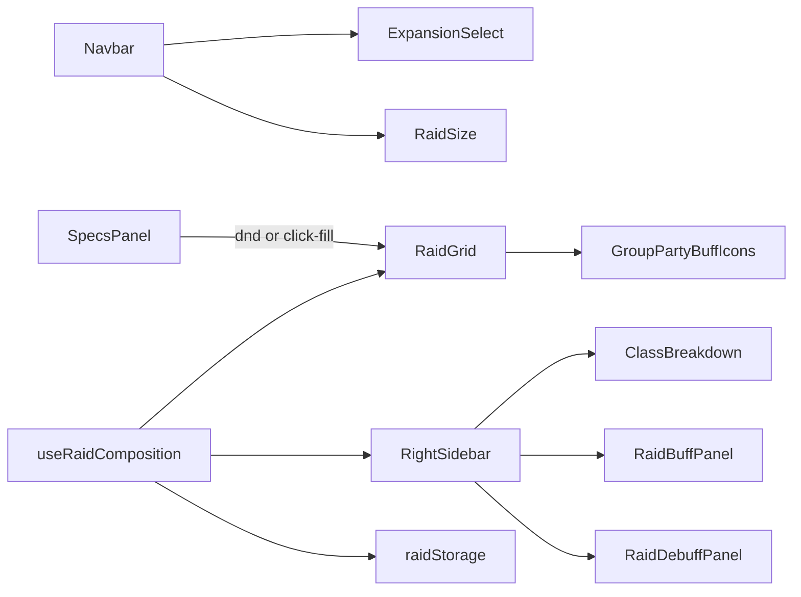

# Wowcomps context

Living product and architecture context for agents and humans. Prefer this file’s glossary and module map when talking about the app. Check source when docs and code disagree.

## What this is

Wowcomps is a single-page World of Warcraft Classic-era **raid composition** tool.

Supported expansions / modes:

- Classic
- The Burning Crusade (TBC)
- Wrath of the Lich King (WotLK)
- Season of Discovery (SoD)
- Classic+ (placeholder / disabled until data exists)

Users build a raid visually: pick expansion and raid size, drag or click-fill specs into a group grid, optionally rename slots with player names, and inspect party + raid buff/debuff coverage in the right sidebar. Working state persists in `localStorage`.

## Stack (as-built)

From `package.json` today:

| Layer         | Choice                                            |
| ------------- | ------------------------------------------------- |
| UI            | React 19 + TypeScript                             |
| Toolchain     | Vite+ (`vp` for install, dev, build, check, test) |
| Styling       | Tailwind CSS v4                                   |
| Drag and drop | `@dnd-kit/core` (+ utilities)                     |
| Icons         | Lucide                                            |
| Tests         | Vitest via `vp test`                              |
| Persistence   | `localStorage`                                    |

**Not in the repo today:** Zustand, Zod. [`docs/plan.md`](docs/plan.md) may mention them as aspirational or undecided — do not invent them into guidance unless they appear in `package.json`.

## Glossary

Use these terms consistently:

| Term                        | Meaning                                                                                      |
| --------------------------- | -------------------------------------------------------------------------------------------- |
| **Expansion**               | Game mode id: `classic` \| `tbc` \| `wotlk` \| `sod` \| `classicPlus`                        |
| **RaidSize**                | `10` \| `20` \| `25` \| `40` (availability depends on expansion)                             |
| **ClassId / SpecId**        | Stable catalog ids for classes and specs                                                     |
| **RaidSlotId**              | String id `{group}-{slot}` (e.g. `1-1`)                                                      |
| **PlacedSpec**              | Slot payload: `classId`, `specId`, optional `playerName`                                     |
| **RaidSlots**               | Map of `RaidSlotId` → `PlacedSpec \| null`                                                   |
| **Party buff**              | Buff tracked per raid group (shown under each group)                                         |
| **Raid buff / raid debuff** | Raid-wide coverage shown in the right sidebar                                                |
| **Coverage**                | Whether a buff/debuff is provided by current raid specs                                      |
| **Tier**                    | `none` \| `base` \| `improved` for consolidator display                                      |
| **Consolidator**            | Helper that merges overlapping buff/debuff rows into one display slot                        |
| **Talent pair**             | Base buff/debuff id paired with its improved/talent id for tooltips                          |
| **Split-diagonal icon**     | Two related buffs in one icon (e.g. Bloodlust/Heroism, Paladin auras, Grace of Air/Windfury) |
| **Working raid**            | Current draft in `localStorage` (`wowcomps:workingRaid`)                                     |
| **Saved raid**              | Named comps (Phase 7; not fully built yet)                                                   |

## How the UI is wired

- [`src/App.tsx`](src/App.tsx) wires layout and dnd-kit; raid mutations live in the composition hook.
- Specs panel is an infinite source palette (duplicates allowed).
- Right sidebar derives class counts and buff/debuff coverage from the same `raidSlots` + expansion + raid size.

## Key modules

### State and mutations

- [`src/lib/useRaidComposition.ts`](src/lib/useRaidComposition.ts) — React state for slots, expansion, raid size; persists on change
- [`src/lib/raidComposition.ts`](src/lib/raidComposition.ts) — pure actions: `placeSpec`, `fillNextEmptySlot`, `clearSlot`, `clearRaid`, `renameSlot`, expansion/size reconcile helpers

### Persistence

- [`src/lib/raidStorage.ts`](src/lib/raidStorage.ts)
- Key: `wowcomps:workingRaid`
- Current shape (storage version **3**): `expansion`, `raidSize`, `raidSlots`, `updatedAt`
- Types: [`src/types/raids.ts`](src/types/raids.ts) (`StoredWorkingRaid`, `WorkingRaidSnapshot`)
- Phase 7 next step: replace this with a full **RaidComposition** object (`name`, `expansion`, `raidSize`, `slots`, `createdAt`, `updatedAt`) and separate saved-raid storage later

### Catalog / data

- [`src/data/expansionData.ts`](src/data/expansionData.ts) — expansion labels, enabled flags, raid sizes
- [`src/data/expansionClasses.ts`](src/data/expansionClasses.ts) — class/spec catalog per expansion
- [`src/data/partyBuffs.ts`](src/data/partyBuffs.ts) — per-party buff definitions + families (Paladin auras, shaman air totems)
- [`src/data/raidBuffs.ts`](src/data/raidBuffs.ts) / [`src/data/raidDebuffs.ts`](src/data/raidDebuffs.ts) — raid-wide catalogs
- Intentional omissions: [`docs/catalog-decisions.md`](docs/catalog-decisions.md)

### Grid

- [`src/lib/grid.ts`](src/lib/grid.ts) — raid grid model and initial slots
- [`src/components/RaidGrid.tsx`](src/components/RaidGrid.tsx), [`src/components/RaidSlot.tsx`](src/components/RaidSlot.tsx)
- Party icons under groups: [`src/components/GroupPartyBuffIcons.tsx`](src/components/GroupPartyBuffIcons.tsx)

### Sidebar pipeline

Typical flow:

1. Handlers build coverage rows from raid specs (`raidBuffHandler`, `raidDebuffHandler`, `partyBuffHandler`, `classesHandler`)
2. Consolidators collapse overlapping effects (`classicTbc*`, `wotlk*`, debuff consolidators)
3. Display helpers attach tooltips / split icons (`getRaidBuffDisplayItems`, `getRaidDebuffDisplayItems`, `formatCoverageTooltip`)
4. Panels render icons + [`CoverageIconTooltip`](src/components/CoverageIconTooltip.tsx)

Entry: [`src/lib/getRightSidebarData.ts`](src/lib/getRightSidebarData.ts) → [`src/components/RightSidebarSections.tsx`](src/components/RightSidebarSections.tsx)

## Product rules that matter

- Infinite source palette — same spec can fill every slot.
- Changing expansion filters invalid class/spec placements and reconciles raid size to an allowed size for that expansion.
- Persist **stable ids** and user fields (`playerName`) only; derive labels, colors, and icons at render time from the catalog.
- Buff/debuff catalog decisions (what not to show) live in [`docs/catalog-decisions.md`](docs/catalog-decisions.md).
- Classic+ stays disabled until class/spec and size data exist ([`docs/build-phases.md`](docs/build-phases.md) Phase 10).

## Build status

Source of truth for checkboxes: [`docs/build-phases.md`](docs/build-phases.md).

| Phase | Status                                                                               |
| ----- | ------------------------------------------------------------------------------------ |
| 0–6   | Complete (shell, domain, state, grid sizes, slot UX, sidebar buffs/debuffs/tooltips) |
| **7** | **In progress** — Persistence and saved comps                                        |
| 8–10  | Not started (templates/sharing, UI polish, Classic+)                                 |

**Phase 7 next unchecked items** (as of last CONTEXT update):

- Replace slots-only storage with a `RaidComposition` object
- Store expansion, raidSize, slots, name, createdAt, updatedAt
- Separate working raid storage from saved raid storage
- Validate persisted data against the domain catalog
- Versioned migrations; save/load/delete/duplicate/rename flows
- Persist only stable IDs and user-entered fields

Done in Phase 7 so far: expansion survives refresh/hot reload (working raid v3).

**Known bug** (see build-phases): adding/removing Balance Druid in WotLK can break the −5% armor raid debuff and may persist across expansions.

## Non-goals (for now)

- Backend services, accounts, authentication
- Combat simulation / optimization / deep stat validation
- Classic+ real content until Phase 10
- Treating older architecture notes as current without checking code

## Doc precedence

When guidance conflicts, prefer:

1. [`CONTEXT.md`](CONTEXT.md) (this file)
2. [`docs/build-phases.md`](docs/build-phases.md)
3. [`docs/plan.md`](docs/plan.md), [`docs/architecture.md`](docs/architecture.md), [`docs/core-features.md`](docs/core-features.md), [`docs/catalog-decisions.md`](docs/catalog-decisions.md), [`docs/data-storage.md`](docs/data-storage.md)
4. Source under `src/`

Note: `docs/architecture.md` and `docs/plan.md` contain useful history and future intent but may be stale relative to the as-built app (e.g. Zustand, early App.tsx ownership). Always verify against code for “what exists now.”

## Agent workflow reminder

Default agent behavior is **Code Mentor**: teach with paste-ready snippets; do not edit the repo unless the user explicitly overrides mentor mode. Always-on rule: [`.cursor/rules/code-mentor.mdc`](.cursor/rules/code-mentor.mdc) → [`.cursor/skills/code-mentor/SKILL.md`](.cursor/skills/code-mentor/SKILL.md). Entry pointers: [`AGENTS.md`](AGENTS.md).
